# Unmasking Human Trafficking - Historical Data Analysis Using Tableau

## Project Overview

This project presents a historical data analysis of **human trafficking cases in India** using **Tableau**.

The analysis focuses on state-wise trafficking cases, trafficking purposes, victims, police case handling, court outcomes, and related population and crime-rate information.

Interactive Tableau visualizations and dashboards were created to explore patterns and provide a clear view of the available human trafficking data.

## Objectives

* Analyze human trafficking cases across States/UTs.
* Examine different purposes of human trafficking.
* Analyze victim and rescued-victim information by gender and age group.
* Study police case handling, chargesheeting, and final reports.
* Analyze court outcomes such as convictions and acquittals/discharges.
* Compare state-wise reported cases with population and IPC crime-rate information.
* Create interactive Tableau dashboards for data exploration.

## Dataset Description

The project uses multiple CSV datasets covering different aspects of human trafficking data.

| Dataset                         | Description                                                                              |
| ------------------------------- | ---------------------------------------------------------------------------------------- |
| `states.csv`                    | State/UT-wise reported cases, percentage share, projected population, and IPC crime rate |
| `human_trafficking_purpose.csv` | Human trafficking cases categorized by purpose                                           |
| `police.csv`                    | Police-handled cases, chargesheeting, final reports, and related rates                   |
| `culprits_disposal_2018.csv`    | Persons arrested, chargesheeted, convicted, and acquitted/discharged                     |
| `rescued.csv`                   | Rescued victims by gender and nationality                                                |
| `victims.csv`                   | Rescued victims by State/UT, gender, and age group                                       |
| `victims_trafficked.csv`        | Trafficked victims by State/UT, gender, and age group                                    |

## Tools & Technologies

* **Tableau**  - Data visualization and dashboard development
* **CSV** - Source datasets
* **Data Analysis** - Exploratory analysis and comparison of human trafficking data
* **Data Visualization** -  Charts, graphs, and interactive dashboards

##  Data Preparation

The datasets were prepared for Tableau analysis by working with the available State/UT, category, gender, age group, and numerical fields.

The data was organized into suitable datasets for analyzing:

* State-wise cases
* Trafficking purposes
* Victims and rescued victims
* Police case handling
* Culprit disposal
* Court outcomes
* Population and IPC crime-rate information

## Analysis & Visualizations

The project includes visualizations covering:

### Human Trafficking Purposes

* Forced Labour
* Sexual Exploitation for Prostitution
* Domestic Servitude
* Forced Marriage
* Petty Crimes
* Child Pornography
* Begging
* Removal of Organs
* Other Reasons

### Police & Court Analysis

* Total number of cases handled by police
* Cases chargesheeted by police
* Cases with final reports by police
* Chargesheeting rate
* Cases convicted by court
* Cases acquitted/discharged by court
* Cases in which trials were completed
* Conviction rate
* Culprits disposal in 2018

### Victim Analysis

* Victims trafficked
* Victims rescued
* Gender-wise victim analysis
* Age-group analysis
* Nationality information for rescued victims

### State-Level Analysis

* State-wise reported cases
* Percentage share of state
* Mid-year projected population
* Rate of cognizable crimes (IPC)

---

## Dashboard Screenshots

### Dashboard 1

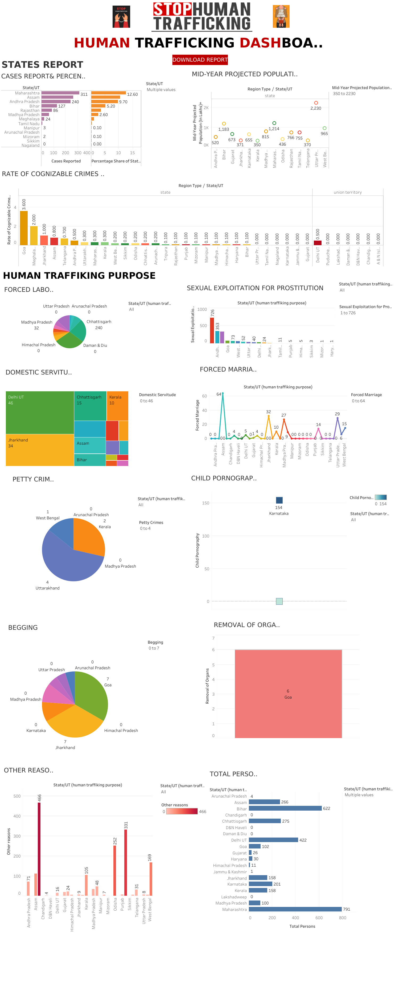

### Dashboard 2

### Human Trafficking Statistics

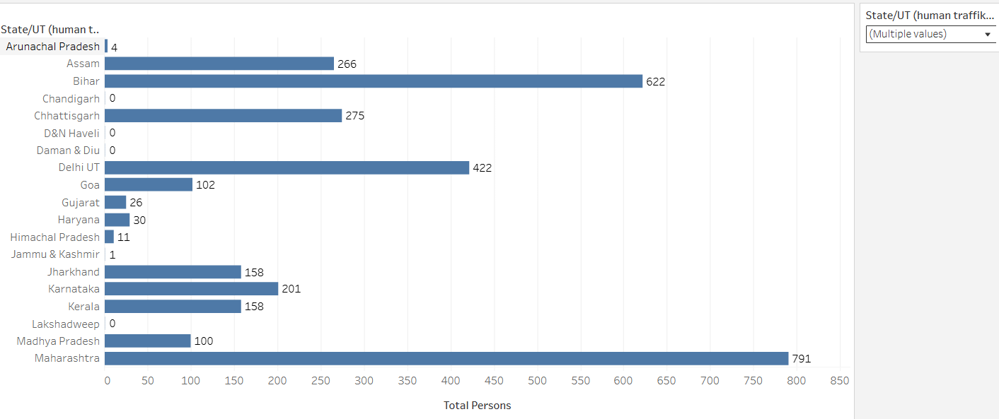

### Begging Statistics

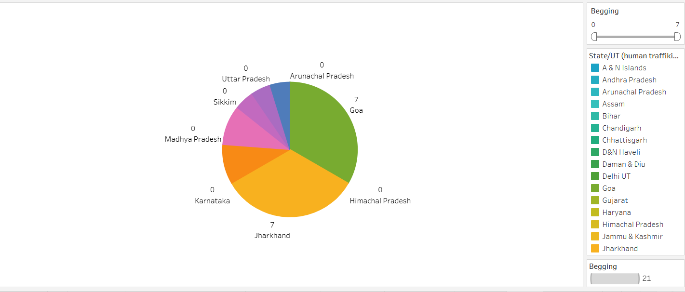

### Culprits Disposal - 2018

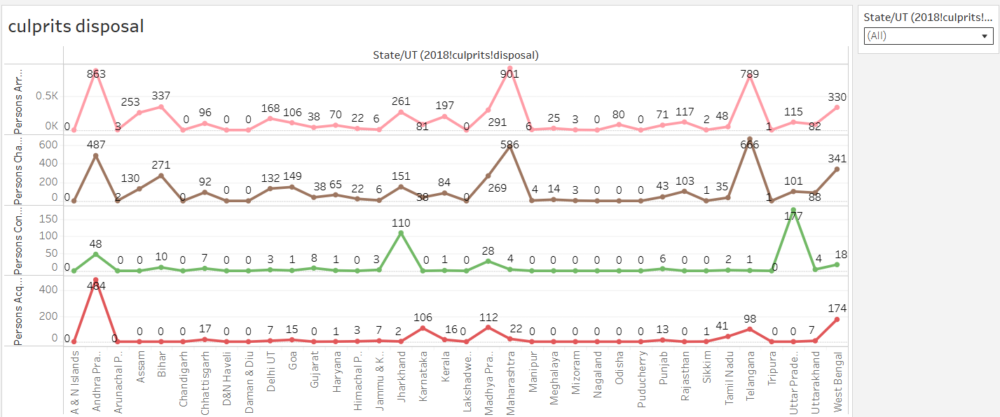

### Police Cases - Chargesheeted, Rate & Final Reports

### Court Cases - Convicted, Acquitted & Completed Trials

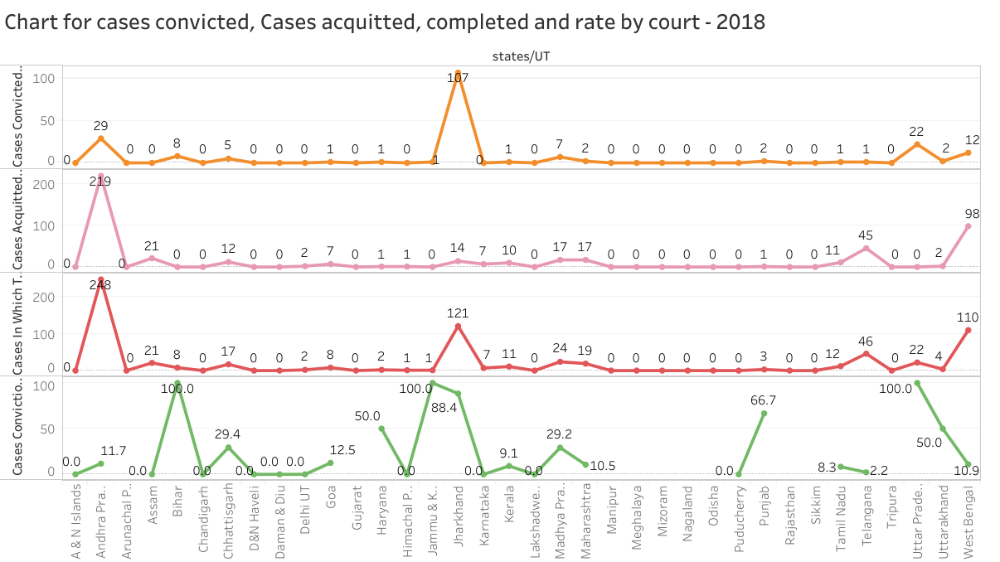

### Child Pornography Statistics

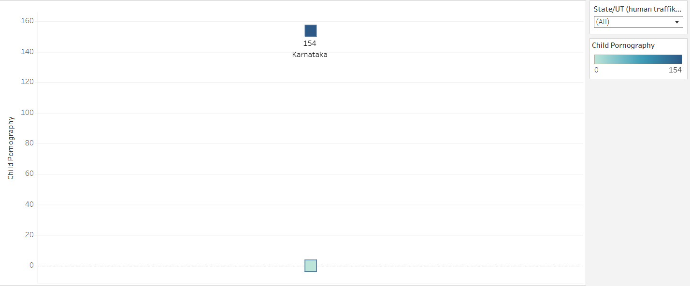

### Domestic Servitude Statistics

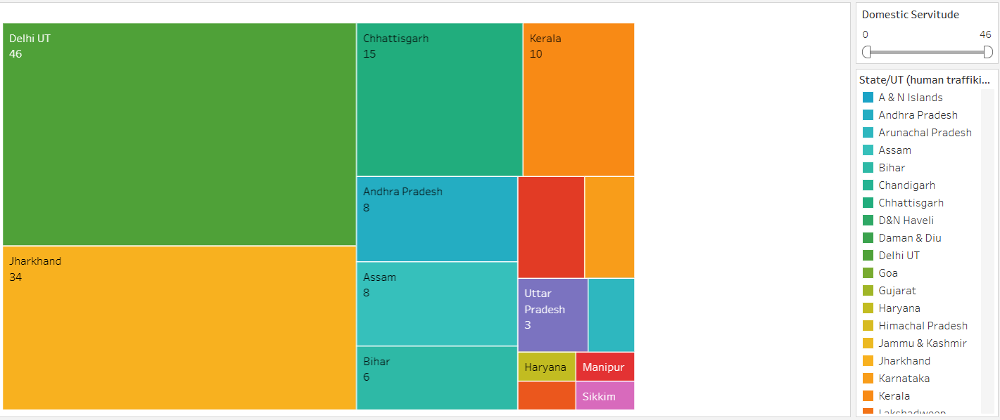

### Forced Labour Statistics

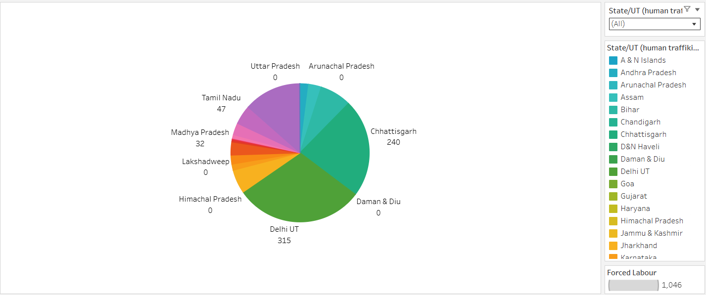

### Forced Marriage Statistics

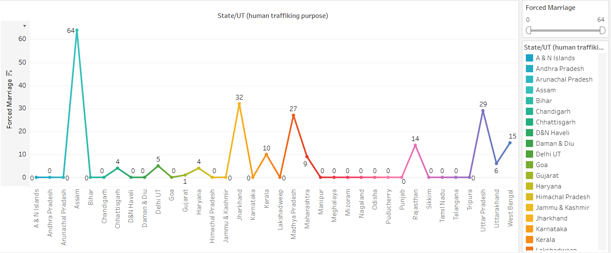

### IPC Analysis

### Mid-Year Projected Population

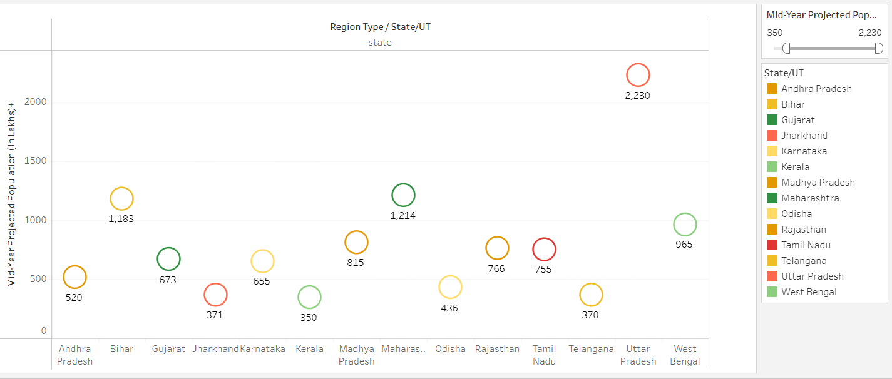

### Other Human Trafficking Reasons

### Petty Crime Statistics

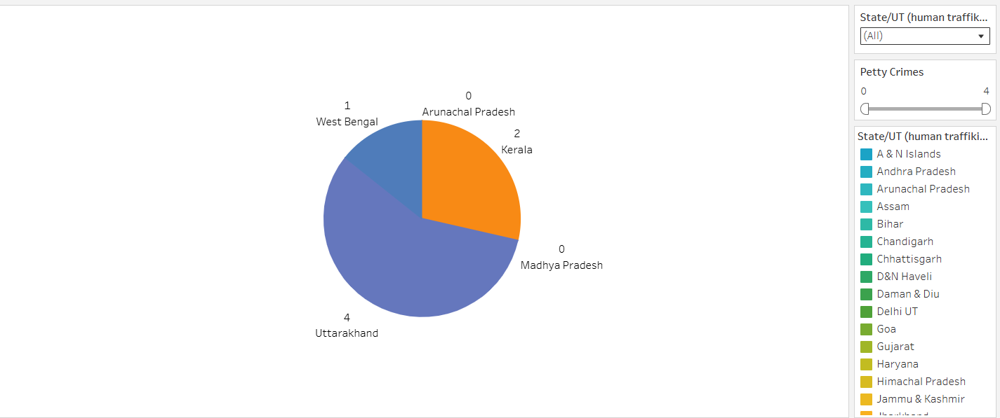

### Removal of Organs Statistics

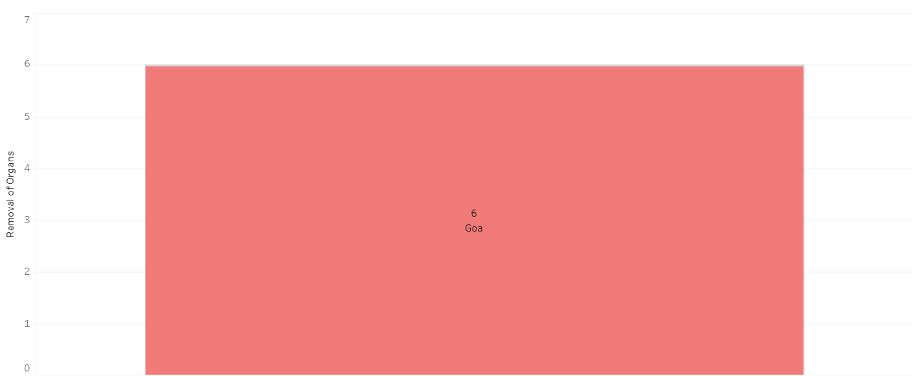

### Sexual Exploitation for Prostitution

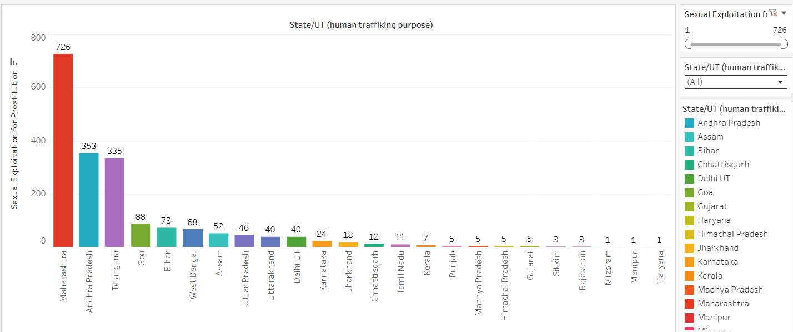

### State-Wise Cases Reported

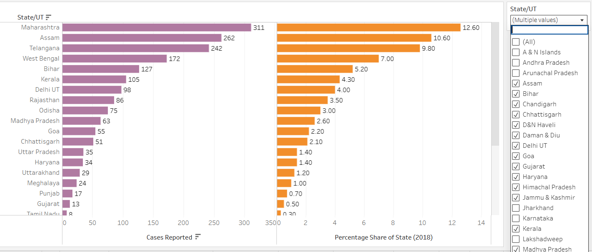

### Total Cases Handled by Police

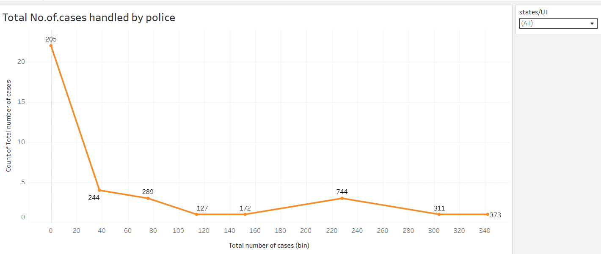

### Victims Trafficked Count

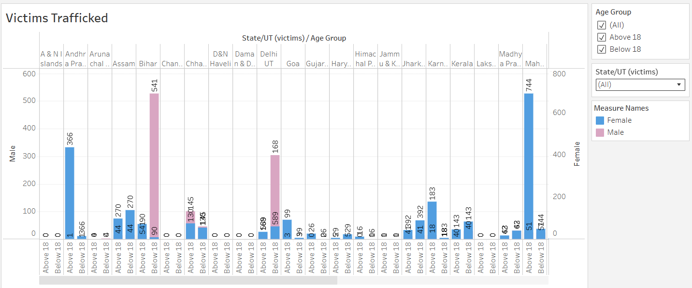

### Victims Count

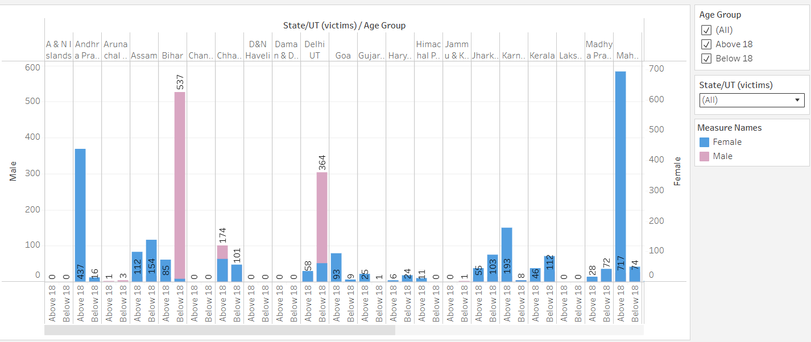

### Additional Analysis

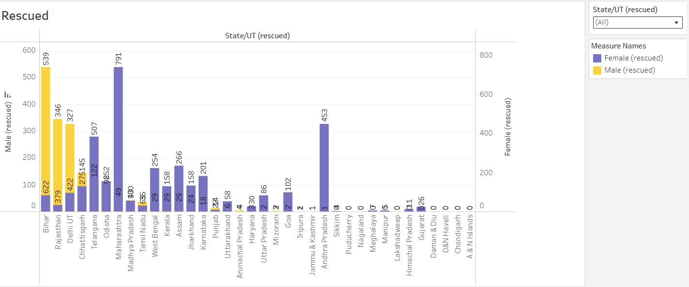

---

##  Key Insights

The dashboards enable exploration of:

* Differences in reported trafficking cases across States/UTs.
* Distribution of trafficking cases across different exploitation purposes.
* Gender and age-group patterns among victims.
* Police case handling and chargesheeting patterns.
* Court-level conviction and acquittal/discharge outcomes.
* Relationship between reported cases, projected population, and IPC crime rate.

> Detailed findings can be explored through the Tableau dashboards and visualizations included in this repository.

---

##  Project Structure

unmasking-human-trafficking-tableau/
│
├── README.md
├── data/
│   ├── culprits_disposal_2018.csv
│   ├── human_trafficking_purpose.csv
│   ├── police.csv
│   ├── rescued.csv
│   ├── states.csv
│   ├── victims.csv
│   └── victims_trafficked.csv
│
├── screenshots/
│   ├── 01-dashboard-1.png
│   ├── 02-dashboard-2.png
│   ├── 03-all-human-trafficking-statistics.png
│   ├── ...
│   └── 22-victims-rescued.png
│
└── tableau/
    └── states-data-analysis.twb

---

## How to Open the Tableau Workbook

1. Install Tableau Desktop.
2. Clone or download this repository.
3. Open the `tableau` folder.
4. Open `states-data-analysis.twb` using Tableau Desktop.
5. If Tableau asks for the data source location, connect the workbook to the CSV files available in the `data` folder.
6. Explore the worksheets, visualizations, and dashboards.

---

## Project Focus

**Human Trafficking Data Analysis | State-wise Analysis | Victim Analysis | Police & Court Analysis | Tableau Dashboards**
